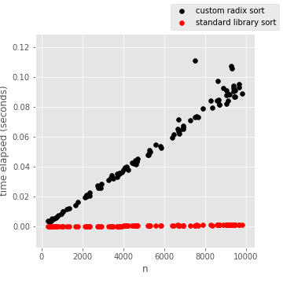

# Radix Sort

This is a custom implementation of a radix sort, for my edification 🎓.

I found it interesting that it scales dramatically worse compared to Python standard library's [Timsort](https://en.wikipedia.org/wiki/Timsort) implementation, which underlies `.sort()` and `sorted()`.

It appears to scale linearly (`O(n)`), as suggested by theory. However, the standard library takes a fraction as long, despite being worst-case `O(n log(n))`.

I imagine this has to do with the C-level implementation.